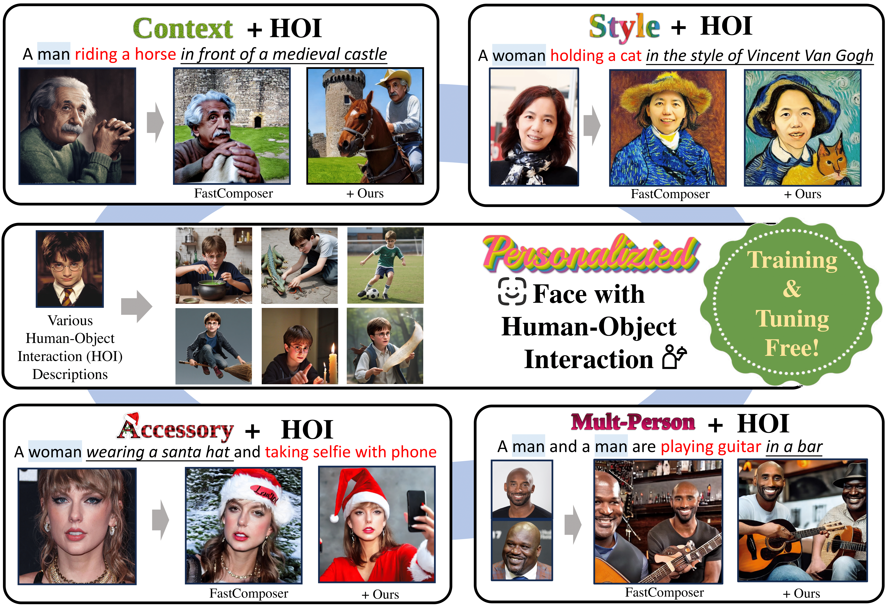
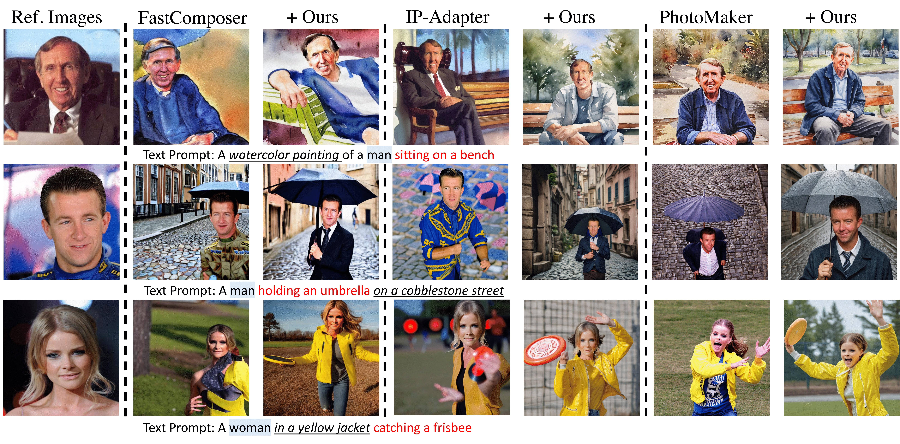
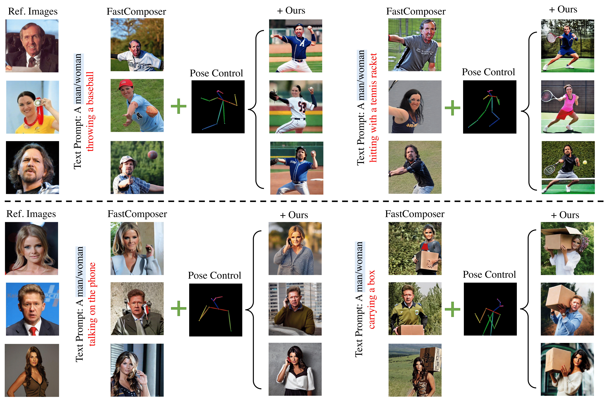

# PersonaHOI 

This is the official repository for the paper **"PersonaHOI: Effortlessly Improving Personalized Face with Human-Object Interaction Generation"** ([arxiv](https://arxiv.org/pdf/2501.05823)). Our components seamlessly integrate into existing personalized face generation models, such as [**FastComposer**](https://github.com/mit-han-lab/fastcomposer/tree/main), [**IP-Adaptor**](https://github.com/tencent-ailab/IP-Adapter), and [**PhotoMaker**](https://github.com/TencentARC/PhotoMaker). We extend our gratitude to the developers of these excellent frameworks for their foundational contributions.

## Personalized Face with Human-Object Interaction (HOI) Generation

*Overview of PersonaHOI illustrating how it improves personalized face generation by incorporating human-object interactions.*

## Integrating General Personalization with HOI 

*Examples of integrating general personalization with HOI across diverse scenarios. From top to bottom, the rows illustrate Style+HOI, Context+HOI, and Accessory+HOI.*

## Integrating [ControlNet](https://github.com/lllyasviel/ControlNet) into PersonaHOI

*Examples of integrating ControlNet into the baseline FastComposer within our PersonaHOI framework to provide precise HOI layout.*

---

**Codes coming soon**
